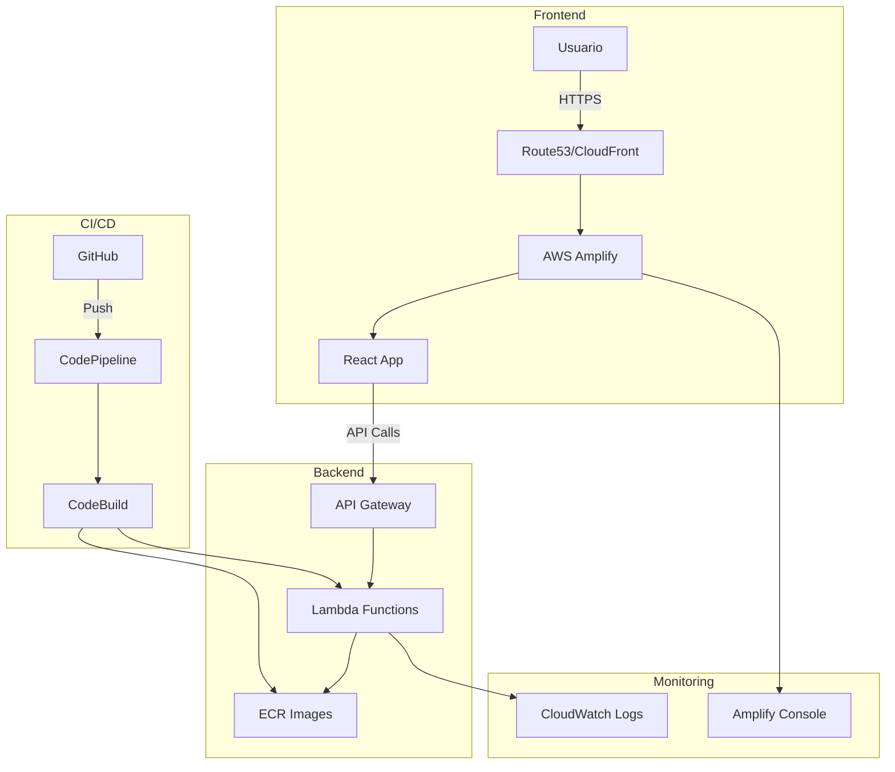
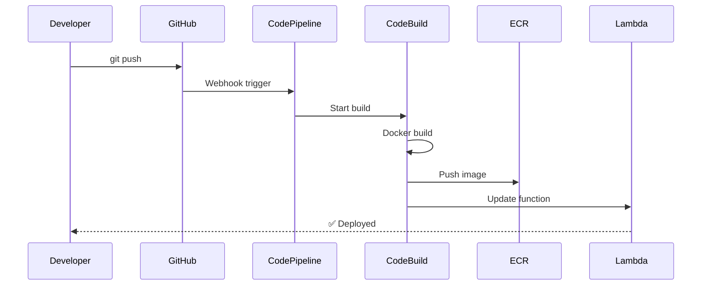

# 🚀 Personal App - Infraestructura como Código


[](https://github.com/iTorrente99/personal-infra-main)
[](https://opensource.org/licenses/MIT)

> Infraestructura completa para una aplicación web moderna con arquitectura serverless, CI/CD automatizado y dominio personalizado.

## 📋 Tabla de Contenidos

- [Visión General](#-visión-general)
- [Arquitectura](#-arquitectura)
- [Stack Tecnológico](#-stack-tecnológico)
- [Estructura del Proyecto](#-estructura-del-proyecto)
- [Prerrequisitos](#-prerrequisitos)
- [Guía de Instalación](#-guía-de-instalación)
- [Uso](#-uso)
- [Configuración del Dominio](#-configuración-del-dominio)
- [Desarrollo](#-desarrollo)
- [CI/CD](#-cicd)
- [Monitoreo y Logs](#-monitoreo-y-logs)
- [Troubleshooting](#-troubleshooting)
- [Mejores Prácticas](#-mejores-prácticas)

## 🌟 Visión General

Este repositorio contiene toda la Infraestructura como Código (IaC) para desplegar una aplicación web completa en AWS. La arquitectura incluye:

- **Backend**: Microservicios serverless con AWS Lambda
- **Frontend**: Aplicación React desplegada en AWS Amplify
- **API**: Gateway REST con endpoints dinámicos
- **CI/CD**: Pipelines automatizados para cada servicio
- **Dominio**: HTTPS automático con dominio personalizado

### Características Principales

✅ **Despliegue Automatizado**: Push to deploy para frontend y backend  
✅ **Escalabilidad**: Arquitectura serverless que escala automáticamente  
✅ **Modular**: Añadir nuevos servicios con pocas líneas de código  
✅ **Seguro**: HTTPS por defecto, autenticación básica en desarrollo  
✅ **Costo-Eficiente**: Paga solo por lo que usas  

## 🏗️ Arquitectura



### Flujo de Datos

1. **Usuario** accede a `https://digicodex.click`
2. **Route53** resuelve el dominio
3. **Amplify** sirve la aplicación React
4. **React** hace llamadas a la API Gateway
5. **API Gateway** enruta a las funciones Lambda
6. **Lambda** procesa y devuelve respuestas

## 🛠️ Stack Tecnológico

### Backend
- **Compute**: AWS Lambda (Container Images)
- **API**: AWS API Gateway REST
- **Container Registry**: Amazon ECR
- **Runtime**: Python 3.11
- **IaC**: Terraform 1.0+

### Frontend
- **Hosting**: AWS Amplify
- **Framework**: React + Vite
- **Routing**: React Router
- **Styling**: Tailwind CSS (opcional)

### CI/CD
- **Source Control**: GitHub
- **Pipelines**: AWS CodePipeline
- **Build**: AWS CodeBuild
- **Connection**: AWS CodeStar Connections

### Dominio y SSL
- **DNS**: Route53
- **SSL**: AWS Certificate Manager
- **CDN**: CloudFront (via Amplify)

## 📁 Estructura del Proyecto

```
personal-infra-main/
├── 📁 environments/           # Configuraciones por ambiente
│   └── 📁 dev/               # Ambiente de desarrollo
│       ├── 🏗️ main.tf        # Recursos principales
│       ├── 🏗️ amplify.tf     # Configuración del frontend
│       ├── 🏗️ lambdas.tf     # Definición de microservicios
│       ├── 🏗️ variables.tf   # Variables del ambiente
│       ├── 🏗️ outputs.tf     # Outputs útiles
│       └── ⚙️ buildspec.yml   # Build spec para lambdas
├── 📁 global/                 # Recursos compartidos
│   └── 📁 ecr/               # Repositorios de contenedores
├── 📁 modules/                # Módulos reutilizables
│   ├── 📁 amplify/           # Frontend hosting
│   ├── 📁 api_gateway/       # API REST
│   ├── 📁 ecr/               # Container registry
│   ├── 📁 lambda/            # Funciones serverless
│   ├── 📁 lambda_service/    # Lambda + Pipeline
│   └── 📁 pipeline/          # CI/CD
└── 📖 README.md              # Este archivo
```

## 📋 Prerrequisitos

### Software Requerido

1. **AWS CLI** v2.0+ ([Instalación](https://docs.aws.amazon.com/cli/latest/userguide/getting-started-install.html))
   ```bash
   aws --version
   ```

2. **Terraform** v1.0+ ([Instalación](https://learn.hashicorp.com/tutorials/terraform/install-cli))
   ```bash
   terraform --version
   ```

3. **Docker Desktop** ([Instalación](https://www.docker.com/products/docker-desktop/))
   ```bash
   docker --version
   ```

4. **Git** ([Instalación](https://git-scm.com/downloads))
   ```bash
   git --version
   ```

### Cuenta AWS

- Cuenta AWS activa con permisos de administrador
- Límites de servicio adecuados para Lambda, ECR, etc.

### GitHub

- Cuenta de GitHub
- Repositorios creados:
  - `personal-infra-main` (este repo)
  - `personal-app-frontend` (código del frontend)
  - `lambda_personal-app_get-journal-data` (código de lambda)

## 🚀 Guía de Instalación

### Paso 1: Clonar el Repositorio

```bash
git clone https://github.com/iTorrente99/personal-infra-main.git
cd personal-infra-main
```

### Paso 2: Configurar AWS CLI

```bash
aws configure
# AWS Access Key ID: [tu-access-key]
# AWS Secret Access Key: [tu-secret-key]
# Default region name: eu-west-1
# Default output format: json
```

### Paso 3: Crear Backend de Terraform

```bash
# Crear bucket S3 para el estado
aws s3 mb s3://tf-state-personal-infra-main --region eu-west-1

# Crear tabla DynamoDB para locks
aws dynamodb create-table \
    --table-name terraform-state-lock \
    --attribute-definitions AttributeName=LockID,AttributeType=S \
    --key-schema AttributeName=LockID,KeyType=HASH \
    --provisioned-throughput ReadCapacityUnits=5,WriteCapacityUnits=5 \
    --region eu-west-1
```

### Paso 4: Crear Conexión con GitHub

1. Ve a [AWS CodePipeline Console](https://console.aws.amazon.com/codesuite/settings/connections)
2. Click "Create connection"
3. Selecciona "GitHub"
4. Autoriza AWS
5. Copia el ARN de la conexión

### Paso 5: Desplegar Recursos Globales

```bash
cd global/ecr
terraform init
terraform plan
terraform apply -auto-approve
cd ../..
```

### Paso 6: Configurar Variables de Entorno

```bash
cd environments/dev
cp terraform.tfvars.example terraform.tfvars
```

Edita `terraform.tfvars`:
```hcl
github_connection_arn = "arn:aws:codeconnections:eu-west-1:XXXX:connection/YYYY"
frontend_github_repository = "https://github.com/TU_USUARIO/personal-app-frontend"
frontend_branch_name = "main"
frontend_basic_auth_password = "contraseña-segura-123"
frontend_custom_domain = "tudominio.com"  # Opcional
```

### Paso 7: Desplegar Infraestructura

```bash
terraform init
terraform plan
terraform apply
```

### Paso 8: Conectar Amplify con GitHub

1. Ve a [AWS Amplify Console](https://console.aws.amazon.com/amplify/)
2. Selecciona tu app
3. Click "Connect repository"
4. Autoriza GitHub y selecciona tu repo

### Paso 9: Verificar Despliegue

```bash
# Ver URLs de acceso
terraform output application_urls

# Probar API
curl $(terraform output -raw api_invoke_url)/get-journal-data
```

## 💻 Uso

### Acceder a la Aplicación

- **Desarrollo**: https://main.dXXXXX.amplifyapp.com
  - Usuario: `admin`
  - Contraseña: (la que configuraste)
- **Producción**: https://tudominio.com

### Endpoints de API

```bash
# Obtener datos del journal
GET https://api.tudominio.com/dev/get-journal-data

# Futuro: Crear entrada
POST https://api.tudominio.com/dev/journal-entry
```

### Comandos Útiles

```bash
# Ver estado de la infraestructura
terraform show

# Actualizar cambios
terraform apply

# Destruir recursos (¡CUIDADO!)
terraform destroy

# Ver logs de Lambda
aws logs tail /aws/lambda/lambda_personal-app_get-journal-data_dev --follow
```

## 🌐 Configuración del Dominio

### Con Route53 (Recomendado)

1. Compra el dominio en Route53
2. Configura en `terraform.tfvars`:
   ```hcl
   frontend_custom_domain = "tudominio.com"
   ```
3. Aplica cambios:
   ```bash
   terraform apply
   ```
4. Amplify configura todo automáticamente

### Con Otro Proveedor

1. Obtén los registros DNS:
   ```bash
   terraform output frontend_dns_verification
   ```
2. Añade los registros CNAME en tu proveedor
3. Espera propagación (hasta 48h)

## 👨‍💻 Desarrollo

### Añadir un Nuevo Microservicio

1. **Crear repositorio** en GitHub:
   ```
   lambda_personal-app_nuevo-servicio
   ```

2. **Añadir a `lambdas.tf`**:
   ```hcl
   locals {
     lambdas_config = {
       # Existentes...
       
       "nuevo-servicio" = {
         base_name   = "lambda_personal-app_nuevo-servicio"
         github_repo = "iTorrente99/lambda_personal-app_nuevo-servicio"
         timeout     = 30
         memory_size = 512
       }
     }
   }
   ```

3. **Aplicar cambios**:
   ```bash
   terraform apply
   ```

4. **Push código** al nuevo repo

### Estructura de una Lambda

```
lambda_personal-app_nuevo-servicio/
├── lambda_function.py    # Código principal
├── requirements.txt      # Dependencias Python
├── Dockerfile           # Imagen del contenedor
└── config.toml         # Configuración y versión
```

### Variables de Entorno

Las Lambdas reciben automáticamente:
- `ENVIRONMENT`: dev/pre/pro
- `REGION`: eu-west-1
- Variables personalizadas que definas

## 🔄 CI/CD

### Pipeline Automático



### Monitorear Builds

- **CodePipeline**: [Console](https://console.aws.amazon.com/codesuite/codepipeline/pipelines)
- **CodeBuild**: Ver logs detallados
- **Amplify**: [Console](https://console.aws.amazon.com/amplify/)

## 📊 Monitoreo y Logs

### CloudWatch Logs

```bash
# Ver logs de Lambda
aws logs tail /aws/lambda/FUNCTION_NAME --follow

# Buscar errores
aws logs filter-log-events \
  --log-group-name /aws/lambda/FUNCTION_NAME \
  --filter-pattern ERROR
```

### Métricas

- **Lambda**: Invocaciones, errores, duración
- **API Gateway**: Requests, latencia, errores 4XX/5XX
- **Amplify**: Builds, deploys, tráfico

### Alarmas (Próximamente)

```hcl
# Ejemplo de alarma para errores
resource "aws_cloudwatch_metric_alarm" "lambda_errors" {
  alarm_name          = "lambda-errors-high"
  comparison_operator = "GreaterThanThreshold"
  evaluation_periods  = "2"
  metric_name         = "Errors"
  namespace           = "AWS/Lambda"
  period              = "300"
  statistic           = "Sum"
  threshold           = "10"
}
```

## 🐛 Troubleshooting

### Errores Comunes

#### "You should at least provide one valid token"
```bash
# Conecta GitHub manualmente en Amplify Console
```

#### "Illegal base64 character"
```bash
# Importa el branch existente
terraform import module.amplify_frontend.aws_amplify_branch.main[0] APP_ID/BRANCH
```

#### Lambda no responde
```bash
# Verificar logs
aws logs tail /aws/lambda/FUNCTION_NAME --follow

# Verificar permisos IAM
aws lambda get-function --function-name FUNCTION_NAME
```

#### Dominio no funciona
1. Verifica registros DNS
2. Espera propagación (hasta 48h)
3. Verifica estado en Amplify Console

### Comandos de Diagnóstico

```bash
# Estado de Terraform
terraform state list
terraform state show MODULE.RESOURCE

# Forzar refresh
terraform refresh

# Recrear recurso específico
terraform apply -replace="module.lambda_service[\"get-journal-data\"]"
```

## 📚 Mejores Prácticas

### Seguridad

1. **Nunca** commits credenciales
2. Usa `terraform.tfvars` (está en .gitignore)
3. Principio de menor privilegio en IAM
4. Habilita MFA en tu cuenta AWS

### Costos

1. Configura alarmas de billing
2. Usa lifecycle policies en ECR
3. Monitorea invocaciones de Lambda
4. Revisa regularmente recursos no utilizados

### Código

1. Usa tags consistentes
2. Versiona tus Lambdas (config.toml)
3. Documenta cambios importantes
4. Test localmente antes de push

### Terraform

1. Siempre `terraform plan` antes de `apply`
2. Usa workspaces para múltiples entornos
3. Mantén módulos pequeños y reutilizables
4. Versiona el estado en S3

---

<div align="center">
  
**[⬆ Volver arriba](#-personal-app---infraestructura-como-código)**

Hecho con ❤️ por [iTorrente99](https://github.com/iTorrente99)

</div>